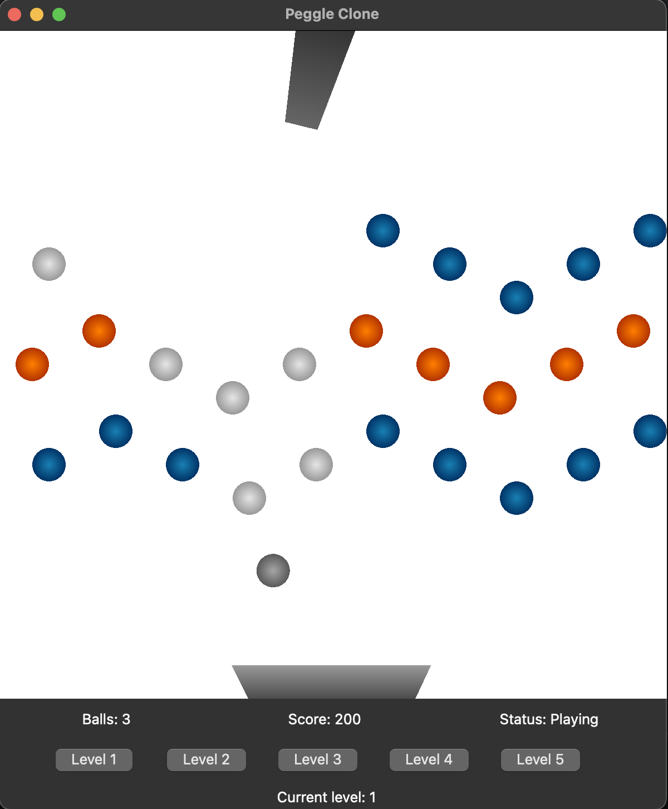

# CSE 165 Project
A simple Peggle clone for CSE 165 Project

### Building
Required: OpenGL 4.1 (Only tested version), Qt 6.6.0
Qt in lib/ was build on Apple Silicon. Edit the package paths in CMakeLists.txt to the correct installation path for Qt if necessary.

To compile: `mkdir build && cd build && cmake .. && make && ./PeggleClone`

